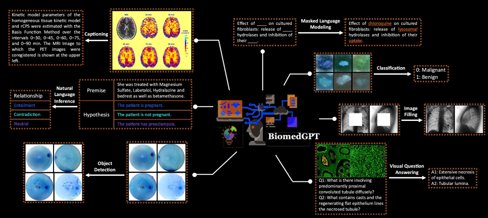
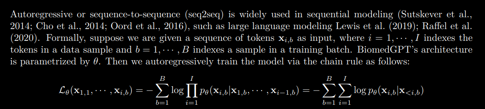
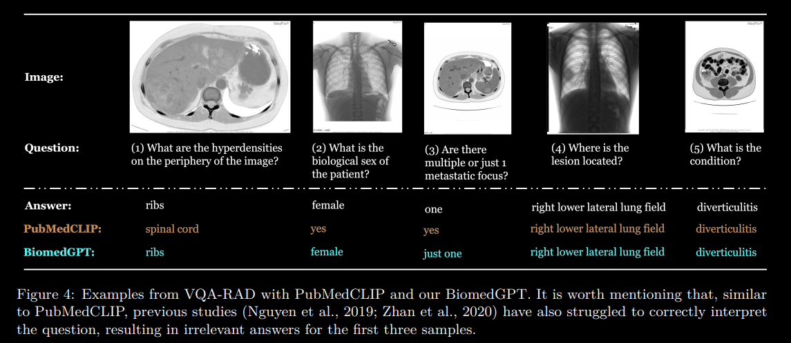

# Code-Review-of-BiomedGPT Based on LLM

In this repo Provide General Overview how does BiomedGPT Built to tackle Multi-Modalities Input to generate Textual Output relate to BioMedical handle multi-Task such :

- Classification
- Caption
- V&Q
- image filling
- masked language modeling

    

**Notation**: WE WILL SPLIT OUR REVIEW PAPER AND CODE FOLLOWING SECTION ..

1. [background](#background)
2. [paper-insghits](#paper-insghits)
3. [BiomedGPT-Pipeline](#BiomedGPT-Pipeline)
4. [Experiments](#Experiments)
5. [Code-Review](#Code-Review)
6. [CONCLUSION](#CONCLUSION)
7. [Limitation](#Limitation)

### background

Introducing BiomedGPT **(Biomedical Generative Pre-trained Transformer)**, the paper presents a versatile model tailored for diverse biomedical data and tasks. Leveraging self-supervision on extensive datasets, BiomedGPT exhibits superior performance over leading benchmarks. **The study encompasses five tasks and 20 public datasets spanning 15 distinct biomedical modalities, highlighting BiomedGPT's broad applicability.** Notably, the authors' innovative multi-modal, multitask pretraining approach showcases effective knowledge transfer to novel data. This contribution marks a significant stride in creating adaptable and comprehensive biomedicine models, offering potential enhancements to healthcare outcomes.

### paper-insghits

we will include the most interesting ideas in the paper the Co-authors discussed and explained in their paper

1. Capabilities of the BiomedGPT Model : 

    The capabilities of the BiomedGPT model have been realized as a result of the study, which has opened up new avenues in biomedical research. This advancement aims to enhance the collaboration between AI and medicine by fostering a deeper understanding of the intricate biological mechanisms that underlie both human health and disease. These contributions are summarized as follows:

    * **Versatility Across Domains**: BiomedGPT spans various biomedical domains, setting a new benchmark for pretraining effectiveness. It excels in pathology, radiology, and academic literature, demonstrating proficiency in different body parts across modalities.

    * **In-depth Insights**: BiomedGPT is designed to encompass a wide range of domains in biomedicine. Our experimental results set a new benchmark, illustrating the feasibility of pretraining across diverse biomedical fields such as pathology, radiology, and academic literature. This is coupled with an ability to handle various body parts across different modalities.

### BiomedGPT-Pipeline

The proposed BiomedGPT model adopts an encoder-decoder architecture, which effectively maps various modalities into a unified semantic representation space and handles diverse tasks.

* **Architecture select**

BiomedGPT is designed based on the [BART architecture](https://huggingface.co/docs/transformers/model_doc/bart), a sequence-to-sequence model with a [BERT-style encoder](https://arxiv.org/abs/2306.03678) and a [GPT-style decoder](https://jalammar.github.io/illustrated-gpt2/). The authors make architectural changes to improve convergence efficiency and stability in pretraining: they add normalization operations, incorporate absolute and relative position embeddings for text and images, and implement decoupling to separate position correlation. These modifications enhance the model’s ability to encode positional information and handle different modalities.

* **Input/Output Unification**

BiomedGPT processes inputs (images, language, bounding boxes) using CNNs for images and ResNet for patches. Linguistic input is tokenized with [BPE is used for subword tokenization](https://huggingface.co/docs/transformers/tokenizer_summary). It handles varied modalities using a finite token vocabulary, including frozen image [quantization](https://medium.com/@joel_34050/quantization-in-deep-learning-478417eab72b), object descriptors, and sparse image encoding. Text outputs use BPE tokens. Images are encoded sparsely, bounding boxes as location token sequences. Task-independent approach for versatile outputs.

* **Natural Language as a Task Manager**:
BiomedGPT derives tasks from handcrafted instructions, avoiding task-specific modules. It handles varied task types like vision-only, text-only, and vision-language. **Pretraining involves masked image modeling, infilling, and object detection. It learns text-only through masked language modeling**. For fine-tuning, it extends to tasks like classification, summarization, and inference, guided by task-specific instructions.

* **Generative Pretraining via Seq2seq** : 

[Autoregressive or seq2seq modeling](https://github.com/christianversloot/machine-learning-articles/blob/main/differences-between-autoregressive-autoencoding-and-sequence-to-sequence-models-in-machine-learning.md) is vital for sequential tasks like language modeling. BiomedGPT, utilizing parameter θ, trains autoregressively via the chain rule. 

    

It combines linguistic and visual tokens, including subwords, image codes, and location tokens. Subwords result from BPE tokenization, with 30% masked for masked language modeling. Object detection involves [Pix2Seq-generated](https://ai.googleblog.com/2022/04/pix2seq-new-language-interface-for.html).[Paper](https://github.com/gaopengcuhk/Unofficial-Pix2Seq) location tokens. Biomedical images undergo preprocessing using [VQ-GAN](https://medium.com/geekculture/vq-gan-explained-4827599b7cf2), producing sparse image codes for masked image modeling. Fine-tuning retains seq2seq, adapting to different datasets and tasks.To enhance quality and address classification challenges, a beam search with a prefix tree (trie) is used. This restricts candidates, boosting decoding efficiency. In trie-based beam search, invalid tokens have -∞ logits, ensuring valid token consideration. This strategy quickens validation during **fine-tuning**, as shown in experiments by the authors.

### Experiments
The models are pre-trained with [**10 Nvidia A5000 GPUs**](#LoRa) and mixed precision, except for the models used for fine-tuning downstream tasks.

* **Results on Unimodal Datasets** :

    The authors tested their BiomedGPT-Base model on three unimodal tasks across 14 datasets. In image classification, the model outperformed on 9 of 10 image-only datasets, except for RetinaMNIST, which was designed for regression. In text-only tasks, the model scored 78.6% accuracy on natural language inference (MedNLI dataset), lower than the 86.5% state-of-the-art. Text summarization of doctor-patient conversations yielded unsatisfactory [ROUGE-L scores](https://medium.com/nlplanet/two-minutes-nlp-learn-the-rouge-metric-by-examples-f179cc285499). Potential reasons for performance disparity include model scale, smaller training corpus, and divergent data between biomedical articles and clinical notes.

    

* **Results on Multimodal Datasets**:

    BiomedGPT excels in image captioning and visual question answering (VQA), utilizing datasets like SLAKE, PathVQA, and VQA-RAD. Limited public multimodal biomedical datasets lead to pre-training on training sets and evaluation on unseen testing sets. BiomedGPT surpasses previous methods in [CIDEr, notably achieving a 273% gain on PEIR Gross](https://arxiv.org/pdf/1905.13302.pdf). Although it lags in IU X-ray's ROUGE-L, the model choice based on CIDEr during validation is cited. SLAKE and PathVQA see substantial improvements. Further fine-tuning epochs could enhance accuracy, with semantically accurate outputs noted, though evaluation may not fully capture semantic understanding.

* **Results on Intra- & Inter-distribution Transfer**:

    Intra- and inter-distribution inference tests assessed BiomedGPT's pre-trained checkpoints on seen and unseen datasets. With SLAKE and [PathVQA](https://arxiv.org/abs/2003.10286) pre-training, BiomedGPT excels, especially in larger models, while the ImageNet-based OFA model suffers notable performance decline. BiomedGPT's potential overfitting to familiar domains hinders understanding of new questions, generating controlled outputs. Example: BiomedGPT-Base misinterpreting VQA as image gen. While text-only outputs partially match, they don't align with open-ended truth. Catastrophic performance occurs in VQA-RAD. This underscores challenges in instruction-guided pretraining for a comprehensive biomedical model. Future work entails data augmentation, synthetic datasets, and privacy solutions.

### Code-Review
in this Section we will go for main folder and file that related how does BioMedGPT designed on [OFA](https://github.com/OFA-Sys/OFA)  which based on sequence modeling toolkit [fairseq](https://github.com/facebookresearch/fairseq)
only we will look most important building block adjusment done by Co-authors to follow PLEASE click [here](code-review/Review.md)

### CONCLUSION 

BiomedGPT demonstrates competitive performance in vision, language, and multimodal tasks by unifying diverse biomedical modalities and tasks within a seq2seq pretraining framework. Incorporating a wide range of biomedical tasks and modalities during pretraining enhances fine-tuning efficiency and overall model performance. The challenge faced by OFA, a generalist model, in aligning image-text pairs during fine-tuning underscores the significance of effective multi-modal, multi-task pretraining, a strength of BiomedGPT. Moreover, increasing model size significantly enhances performance.

### Limitation 

in here i will suggested some of solutions could improve BioMedGPT-Based model based on it owns limitation :

1. BiomedGPT's response to instructions can be erratic, suggesting the need to enhance its understanding through a broader range of high-quality instruction sets during pretraining.

2. Achieving data diversity by balancing size ratios and training sequences across different biomedical modalities warrants investigation.

3. Implementing Reinforcement Learning from human or AI feedback (RLF) to align BiomedGPT with intended outcomes is promising, albeit resource-intensive for specific biomedical applications.

4. Navigating differences between clinical notes, general/biomedical text, and vision-only tasks presents difficulties for text-only downstream tasks. Building a comprehensive vocabulary across domains and adjusting text input ratios during pretraining could mitigate these challenges.

5. Efficient fine-tuning for large-scale generalist biomedical models requires attention to training speed and memory usage. Parameter-efficient fine-tuning (PEFT) offers a potential solution worth exploring or Re-Tune using LoRa .

6. Experimentation with prompt tuning yielded unexpected outcomes, warranting further investigation.