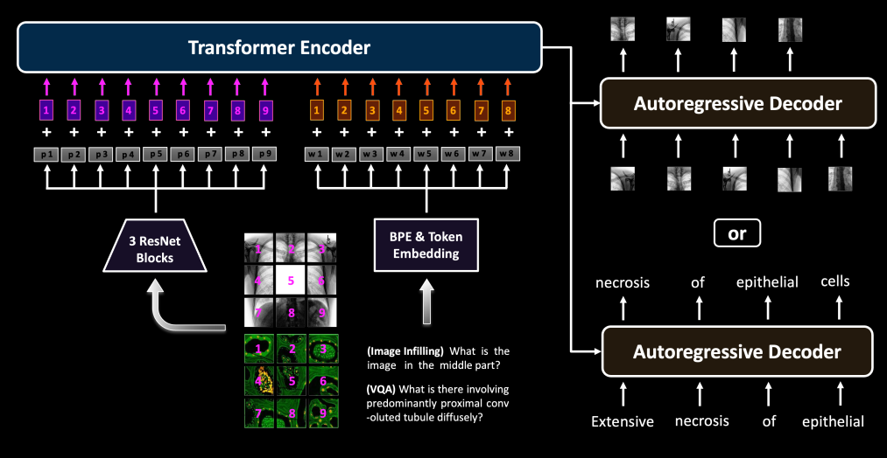
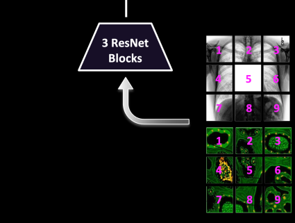
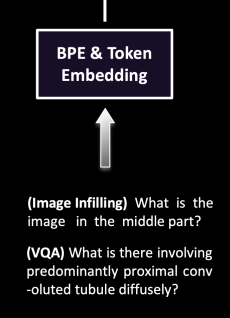

### Code-Review
in Section we will go for main folder and file that related how does BioMedGPT designed because the code based on Project is bigger and include many external packages , which means we will cover most relative file used to build the based model following :

* **BiomedGPT model**:

BiomedGPT is developed based on OFA. in Case we will focus on the most important **building Blocks of BioMedGPT** 

<div align="center">
    
</div>

###### building Blocks of BioMedGPT : 

1. **Handling Multi-modalites Input/Output**:

we explained how does BioMedGPT Handle multi-modalites fisrt let us dive in to the adjustment within Model done from Co-Authors 

* **add ResNet Blocks**:

To enable inputs with a wide range of modalities, including images, language, and bounding boxes, to be
processed within a single model, it is necessary to embed them in a shared and unified space. For visual inputs,
we directly apply CNN backbones to relax the heavy image feature extraction process, including object
detection. 

<div align="center">
    
</div>

Specifically, BiomedGPT receives the raw image $\mathbf{x}_v \in \mathbb{R}^{H \times W \times C}$ and maps it into a flattened 1D sequence of patches $\mathbf{x}_p \in \mathbb{R}^{N \times D}$ via a ResNet module as input for the transformer, where $N = \frac{H \times W}{P^2}$ is the number of patches given the patch size of $P \times P$, and $D$ is the fixed hidden size of the transformer layers.

```python
class ResNet(nn.Module):

    def __init__(self, layers, zero_init_residual=False,
                 groups=1, width_per_group=64, replace_stride_with_dilation=None,
                 norm_layer=None, drop_path_rate=0.0):
        super(ResNet, self).__init__()
        if norm_layer is None:
            norm_layer = nn.BatchNorm2d
        self._norm_layer = norm_layer

        self.inplanes = 64
        self.dilation = 1
        if replace_stride_with_dilation is None:
            # each element in the tuple indicates if we should replace
            # the 2x2 stride with a dilated convolution instead
            replace_stride_with_dilation = [False, False, False]
        if len(replace_stride_with_dilation) != 3:
            raise ValueError("replace_stride_with_dilation should be None "
                             "or a 3-element tuple, got {}".format(replace_stride_with_dilation))
        self.groups = groups
        self.base_width = width_per_group
        self.conv1 = nn.Conv2d(3, self.inplanes, kernel_size=7, stride=2, padding=3,
                               bias=False)
        self.bn1 = norm_layer(self.inplanes)
        self.relu = nn.ReLU(inplace=True)
        self.maxpool = nn.MaxPool2d(kernel_size=3, stride=2, padding=1)
        self.layer1 = self._make_layer(Bottleneck, 64, layers[0], drop_path_rate=drop_path_rate)
        self.layer2 = self._make_layer(Bottleneck, 128, layers[1], stride=2,
                                       dilate=replace_stride_with_dilation[0], drop_path_rate=drop_path_rate)
        self.layer3 = self._make_layer(Bottleneck, 256, layers[2], stride=2,
                                       dilate=replace_stride_with_dilation[1], drop_path_rate=drop_path_rate)

        for m in self.modules():
            if isinstance(m, nn.Conv2d):
                nn.init.kaiming_normal_(m.weight, mode='fan_out', nonlinearity='relu')
            elif isinstance(m, (nn.SyncBatchNorm, nn.BatchNorm2d, nn.GroupNorm)):
                nn.init.constant_(m.weight, 1)
                nn.init.constant_(m.bias, 0)

        if zero_init_residual:
            for m in self.modules():
                if isinstance(m, Bottleneck):
                    nn.init.constant_(m.bn3.weight, 0)
                elif isinstance(m, BasicBlock):
                    nn.init.constant_(m.bn2.weight, 0)

    def _make_layer(self, block, planes, blocks, stride=1, dilate=False, drop_path_rate=0.0):
        norm_layer = self._norm_layer
        downsample = None
        previous_dilation = self.dilation
        if dilate:
            self.dilation *= stride
            stride = 1
        if stride != 1 or self.inplanes != planes * block.expansion:
            downsample = nn.Sequential(
                conv1x1(self.inplanes, planes * block.expansion, stride),
                norm_layer(planes * block.expansion),
            )

        layers = []
        layers.append(block(self.inplanes, planes, stride, downsample, self.groups,
                            self.base_width, previous_dilation, norm_layer))
        self.inplanes = planes * block.expansion

        dpr = [x.item() for x in torch.linspace(0, drop_path_rate, blocks)]
        for i in range(1, blocks):
            layers.append(block(self.inplanes, planes, groups=self.groups,
                                base_width=self.base_width, dilation=self.dilation,
                                norm_layer=norm_layer, drop_path_rate=dpr[i]))

        return nn.Sequential(*layers)

    def _forward_impl(self, x):
        # See note [TorchScript super()]
        x = self.conv1(x)
        x = self.bn1(x)
        x = self.relu(x)
        x = self.maxpool(x)

        x = self.layer1(x)
        x = self.layer2(x)
        x = self.layer3(x)

        return x

    def forward(self, x):
        return self._forward_impl(x)

```

**Addionally** : we have an Hyper-parameter **resnet_drop_path_rate** used 

 * Drop paths (Stochastic Depth) per sample (when applied in main path of residual blocks). This is the same as the DropConnect impl I created for EfficientNet, etc networks, however, the original name is misleading as 'Drop Connect' is a.sh different form of dropout in a.sh separate paper.See discussion: https://github.com/tensorflow/tpu/issues/494#issuecomment-532968956 ... I've opted for changing the layer and argument names to 'drop path' rather than mix DropConnect as a.sh layer name and use 'survival rate' as the argument.

 check following [File](blocks_Model/dropath.py)


and has been adjust into file **ofa** which the main transformer model use to built BioMedGPT

```python
    unify_transformer.py    
```

* **byte-pair encoding**: 

 they used byte-pair encoding (BPE) to perform the subword tokenization.The subwords are then embedded into the input features.

 <div align="center">
    
</div>

 ```python
 def register_embedding_tokens(self, ans2label_dict, src_dict, bpe):
        """Register embedding tokens"""
        logger.info("Registering embedding tokens")
        self.ans_tensor_list = []
        for i in range(len(ans2label_dict)):
            ans = src_dict[-len(ans2label_dict)+i]
            ans = ans[5:-1].replace('_', ' ')
            ans_tensor = src_dict.encode_line(
                line=bpe.encode(' {}'.format(ans.lower())),
                add_if_not_exist=False,
                append_eos=False
            ).long()
            self.ans_tensor_list.append(ans_tensor)
 
 ```


 ### Frozen image quantization

* they  utilized the frozen image quantization and object descriptor  to discretize the images and objects on the target side, respectively. As to the text outputs, such as object labels and summarizations, we represent them with BPE tokens. To be more specific,

**more Details**:

* Frozen image quantization refers to the process of discretizing images in order to reduce their size and make them more suitable for certain tasks, such as object recognition or image classification. This technique is often used in combination with deep learning models, where the quantized images are used as inputs to the models. In addition to reducing image size, frozen image quantization can also improve the efficiency and accuracy of deep learning models by reducing the number of parameters that need to be processed. However, it is important to carefully select the quantization method and parameters in order to ensure that the resulting images are still suitable for the intended task.

```python 
class FrozenBatchNorm2d(nn.Module):
    """
    Batch normalization layer with fixed batch statistics and affine parameters.

    This module implements batch normalization where the batch statistics and the affine
    parameters are fixed. The class registers non-trainable buffers for "weight", "bias",
    "running_mean", and "running_var", initialized to perform an identity transformation.

    The forward pass is implemented using `F.batch_norm(..., training=False)`.

    Args:
        num_features (int): Number of input features.
        eps (float, optional): A small value added to the denominator for numerical stability.

    Attributes:
        num_features (int): Number of input features.
        eps (float): Small value added to the denominator.
        weight (torch.Tensor): Non-trainable buffer for affine weight.
        bias (torch.Tensor): Non-trainable buffer for affine bias.
        running_mean (torch.Tensor): Non-trainable buffer for running mean.
        running_var (torch.Tensor): Non-trainable buffer for running variance.

    """
    def __init__(self, num_features, eps=1e-5):
        super().__init__()
        self.num_features = num_features
        self.eps = eps
        self.register_buffer("weight", torch.ones(num_features))
        self.register_buffer("bias", torch.zeros(num_features))
        self.register_buffer("running_mean", torch.zeros(num_features))
        self.register_buffer("running_var", torch.ones(num_features) - eps)

    def forward(self, x):
        """
        Forward pass through the FrozenBatchNorm2d layer.

        Args:
            x (torch.Tensor): Input tensor.

        Returns:
            torch.Tensor: Output tensor.

        """
        if x.requires_grad:
            scale = self.weight * (self.running_var + self.eps).rsqrt()
            bias = self.bias - self.running_mean * scale
            scale = scale.reshape(1, -1, 1, 1)
            bias = bias.reshape(1, -1, 1, 1)
            out_dtype = x.dtype
            return x * scale.to(out_dtype) + bias.to(out_dtype)
        else:
            return F.batch_norm(
                x,
                self.running_mean,
                self.running_var,
                self.weight,
                self.bias,
                training=False,
                eps=self.eps,
            )

    def _load_from_state_dict(self, state_dict, prefix, local_metadata, strict,
                              missing_keys, unexpected_keys, error_msgs):
        """
        Load model state from a dictionary.

        This method handles loading of state dictionary and adjusts the state keys
        based on version information.

        Args:
            state_dict (dict): Model state dictionary.
            prefix (str): Prefix to apply to state keys.
            local_metadata (dict): Local metadata.
            strict (bool): Whether to strictly enforce that the keys match.
            missing_keys (list): List of missing keys.
            unexpected_keys (list): List of unexpected keys.
            error_msgs (list): List of error messages.

        """
        num_batches_tracked_key = prefix + 'num_batches_tracked'
        if num_batches_tracked_key in state_dict:
            del state_dict[num_batches_tracked_key]
        version = local_metadata.get("version", None)

        if version is None or version < 2:
            if prefix + "running_mean" not in state_dict:
                state_dict[prefix + "running_mean"] = torch.zeros_like(self.running_mean)
            if prefix + "running_var" not in state_dict:
                state_dict[prefix + "running_var"] = torch.ones_like(self.running_var)

        super()._load_from_state_dict(
            state_dict, prefix, local_metadata, strict, missing_keys, unexpected_keys, error_msgs
        )

    def __repr__(self):
        """
        Return a string representation of the FrozenBatchNorm2d module.

        Returns:
            str: String representation.

        """
        return "FrozenBatchNorm2d(num_features={}, eps={})".format(self.num_features, self.eps)

```
### Natural Language as a Task Manager

Multitasking is vital in a unified model. We build on prompt learning literatureand existing frameworks, using custom instructions for tasks, excluding VQA. BiomedGPT handles vision-only, text-only, and vision-language tasks, ensuring a comprehensive approach. they elaborate on pretraining, fine-tuning, and instructions for various tasks.

and **PromptEncoder** used both of Encoder and Decoder Blocks 

```python 

class PromptEncoder(torch.nn.Module):
    r"""
    Prompt encoder to generate prompts, including prompt, prefix, instance and instruction
    """

    def __init__(
            self,
            type,
            length,
            projection,
            embed_dim,
            proj_dim,
            layers,
            vocab_size):
        super().__init__()
        self.prefix_projection = projection

        if type == "prefix":
            layers = layers
            prompt_vocab_size = length

        if self.prefix_projection:
            self.embedding = torch.nn.Embedding(prompt_vocab_size, embed_dim)
            self.trans = torch.nn.Sequential(
                torch.nn.Linear(embed_dim, proj_dim),
                torch.nn.ReLU(),
                torch.nn.Linear(proj_dim, layers * 2 * embed_dim)
            )
        else:
            if type == "prefix":
                self.embedding = torch.nn.Embedding(
                    prompt_vocab_size, layers * 2 * embed_dim)

    def forward(self, prefix: torch.Tensor):
        if self.prefix_projection:
            prefix_tokens = self.embedding(prefix)
            past_key_values = self.trans(prefix_tokens)
        else:
            past_key_values = self.embedding(prefix)
        return past_key_values
```
### Gnerative Pretraining via Seq2seq

Preprocessing biomedical images for VQ-GAN quantization requires addressing trivial semantics like black backgrounds and unmatched input sizes. We eliminate background, crop to object bounds, and resize to 256x256. The central 128x128 part is input to pre-trained VQ-GAN for sparse image code generation in the MIM task. Vision-language tasks share this tokenization process. In fine-tuning, we use seq2seq learning with distinct datasets and tasks.

```python
import sys

sys.path.append('../../../')
import argparse
import base64
from io import BytesIO
from data.file_dataset import FileDataset
from PIL import Image, ImageFile
from torchvision import transforms
from omegaconf import OmegaConf
from models.taming.models.vqgan import GumbelVQ
import os

import torch
from torch.utils.data import Dataset, DataLoader
import numpy as np

ImageFile.LOAD_TRUNCATED_IMAGES = True
ImageFile.MAX_IMAGE_PIXELS = None
Image.MAX_IMAGE_PIXELS = None


class VQGANDataset(Dataset):
    def __init__(self, file, selected_cols):
        self.reader = FileDataset(
            file,
            selected_col_ids=selected_cols,
        )
        self.code_resize_transform = transforms.Compose([
            lambda image: image.convert("RGB"),
            transforms.Resize((args.code_image_size, args.code_image_size), interpolation=Image.LANCZOS),
            transforms.ToTensor(),
            preprocess_vqgan
        ])

    def __len__(self):
        return len(self.reader)

    def __getitem__(self, item):
        column_l = self.reader[item]
        if len(column_l) == 4:
            pair_id, image_id, image, text = column_l
        elif len(column_l) == 2:
            image_id, image = column_l
        else:
            raise NotImplementedError

        image = Image.open(BytesIO(base64.urlsafe_b64decode(image)))
        code_image = self.code_resize_transform(image)
        if len(column_l) == 4:
            return {"code_image": code_image, "pair_id": pair_id, "image_id": image_id, "text": text}
        elif len(column_l) == 2:
            return {"code_image": code_image, "image_id": image_id}


def custom_to_pil(x):
    x = x.detach().cpu()
    x = torch.clamp(x, -1., 1.)
    x = (x + 1.) / 2.
    x = x.permute(1, 2, 0).numpy()
    x = (255 * x).astype(np.uint8)
    x = Image.fromarray(x)
    if not x.mode == "RGB":
        x = x.convert("RGB")
    return x


def map_pixels(x, eps=0.1):
    return (1 - 2 * eps) * x + eps


def preprocess_vqgan(x):
    x = 2. * x - 1.
    return x


def image_to_base64(img, format):
    output_buffer = BytesIO()
    img.save(output_buffer, format=format)
    byte_data = output_buffer.getvalue()
    base64_str = base64.b64encode(byte_data)
    base64_str = str(base64_str, encoding='utf-8')
    return base64_str


if __name__ == "__main__":
    parser = argparse.ArgumentParser()
    parser.add_argument("--file", type=str, default="")
    parser.add_argument("--outputs", type=str, default="")
    parser.add_argument("--selected_cols", type=str, required=True)
    parser.add_argument("--code_image_size", type=int, required=True)
    parser.add_argument("--vq_model", type=str, required=True)
    parser.add_argument("--vqgan_model_path", type=str, default=None)
    parser.add_argument("--vqgan_config_path", type=str, default=None)
    parser.add_argument("--log_interval", default=100, type=int, help="log interval")
    parser.add_argument("--worker_cnt", type=int, default=1)
    parser.add_argument("--local_rank", type=int, default=0)
    parser.add_argument("--batch_size", type=int, default=32)
    args = parser.parse_args()

    # device = torch.device('cuda:9')
    vqgan_config = OmegaConf.load(args.vqgan_config_path)
    vqgan = GumbelVQ(**vqgan_config.model.params)
    sd = torch.load(args.vqgan_model_path, map_location="cpu")["state_dict"]
    missing, unexpected = vqgan.load_state_dict(sd, strict=False)
    for k, v in vqgan.named_parameters():
        v.requires_grad = False
    image_tokenizer = vqgan.cuda().eval()

    writer = open(args.outputs, 'w')

    print("begin process")

    data_cnt = 0

    dataset = VQGANDataset(args.file, args.selected_cols)
    dataloader = DataLoader(dataset, batch_size=args.batch_size)

    for data in dataloader:
        batch_size = data["code_image"].size()[0]
        with torch.no_grad():
            z, _, [_, _, image_codes] = image_tokenizer.encode(data["code_image"].cuda())
            image_codes = image_codes.view(batch_size, -1).detach()

        for i, image_code in enumerate(image_codes):
            code = ' '.join([str(num) for num in image_code.tolist()])

            if len(data.keys()) == 4:
                writer.write('\t'.join([data['pair_id'][i], data['image_id'][i], data['text'][i], code])+'\n')
            elif len(data.keys()) == 2:
                writer.write('\t'.join([data['image_id'][i], code])+'\n')
            else:
                raise NotImplementedError
    writer.close()

    print("finish")
```

and Bash Script 

```shell

CUDA_VISIBLE_DEVICES=0 CUDA_LAUNCH_BLOCKING=1 python generate_code.py \
  --file ./datasets/pretraining/chexpert_mid_image_string.tsv  \
  --outputs ./datasets/pretraining/chexpert_image_code.tsv \
  --selected_cols 0,1 \
  --code_image_size 128 \
  --vq_model vqgan \
  --vqgan_model_path ./checkpoints/vqgan_gumbel_f8_8192/ckpts/last.ckpt \
  --vqgan_config_path ./checkpoints/vqgan_gumbel_f8_8192/configs/model.yaml

```
### Loss Functions 
they used 
[AdjustLabelSmoothedCrossEntropyCriterion](https://fairseq.readthedocs.io/en/latest/_modules/fairseq/criterions/label_smoothed_cross_entropy.html) to train BioMedGPT , within  adujst  loss function for sequence-to-sequence models in the Fairseq library. The criterion is designed to handle various modifications and enhancements for improved convergence and stability in biomedical text and image tasks. Here's a step-by-step explanation of its key components:

1. Initialization:

    The criterion is initialized with several parameters that control its behavior, such as sentence_avg, label_smoothing, ignore_prefix_size, and more.
    It also handles options like report_accuracy, drop_worst_ratio, drop_worst_after, use_rdrop, reg_alpha, sample_patch_num, and constraint_range.

2. Forward Pass:

    The forward method computes the loss for the given input sample.
    If multiple samples are provided (as a list), it calculates the losses individually and combines them.
    For each sample, it optionally incorporates R-Drop regularization and then computes the model's output.
    The loss, sample size, and logging outputs are returned.

3. Loss Computation:

    The compute_loss method calculates the loss based on the predicted probabilities and target tokens.
    It incorporates label smoothing using the epsilon value (self.eps) and applies R-Drop and other regularization techniques if specified.
    The function also handles constraints on the predicted tokens using the constraint_masks and constraint_start/constraint_end parameters.

3. Accuracy Computation:

    The compute_accuracy method computes accuracy by comparing predicted tokens to target tokens, considering masking and constraints.

4. Metric Aggregation:

    The reduce_metrics method aggregates logging outputs across parallel workers during distributed training.
    It calculates and logs various metrics, including losses, perplexity, accuracy, token counts, and sentence counts.

5. Summability of Logging Outputs:

    The logging_outputs_can_be_summed method indicates that the logging outputs returned by forward can be summed across workers before metric reduction, improving distributed training efficiency.

main file of [criterion](BioMedGPT/criterions/label_smoothed_cross_entropy.py)

### Summary ( HOW DOES BioMedGPT Built )

BioMedGPT designed based [OFA](https://github.com/OFA-Sys/OFA)  which used sequence modeling toolkit [fairseq](https://github.com/facebookresearch/fairseq) that used Transfomer Archticure as core to build different model based on Task specification 
here the general following Step of building BioMedGPT

1. Foundation and Backbone:
        BiomedGPT is designed with inspiration from existing techniques.
        BART serves as the foundational architecture, combining BERT-style encoding for corrupted text and GPT-style autoregressive decoding.

2. Architectural Adaptations:
        BART's architecture is customized for BiomedGPT.
        For improved convergence and stability during pretraining:
            Each layer incorporates three normalization operations, including post-attention Layer Norm, post-first-FFN LN, and head-wise scaling within self-attention.

3. Positional Information Encoding:
        Absolute position embeddings are introduced for both text and images.
        A decoupling method is implemented to disentangle position correlation, enhancing positional information utilization.

4. Relative Position Bias:
        BiomedGPT integrates relative position bias to enhance context understanding:
            1D relative position bias is employed for text.
            2D relative position bias is utilized for images.

Through these steps, BiomedGPT's design ensures improved convergence, stability, and context representation, tailored for biomedical tasks.

tha main file was Adujst following all the Main Building blocks we explain so far is **unify_transformer** and 
agruments bass to reconstruct the BioMedGPT is **ofa.py**

```python 

@register_model_architecture("ofa", "ofa_large") #=> **BioMedGPT-Large**

@register_model_architecture("ofa", "ofa_base") #=> **BioMedGPT-base**

@register_model_architecture("ofa", "ofa_huge") #=> **BioMedGPT-huge**

@register_model_architecture("ofa", "ofa_medium") #=> **BioMedGPT-medium**

@register_model_architecture("ofa", "ofa_tiny") #=> **BioMedGPT-tiny**
```

